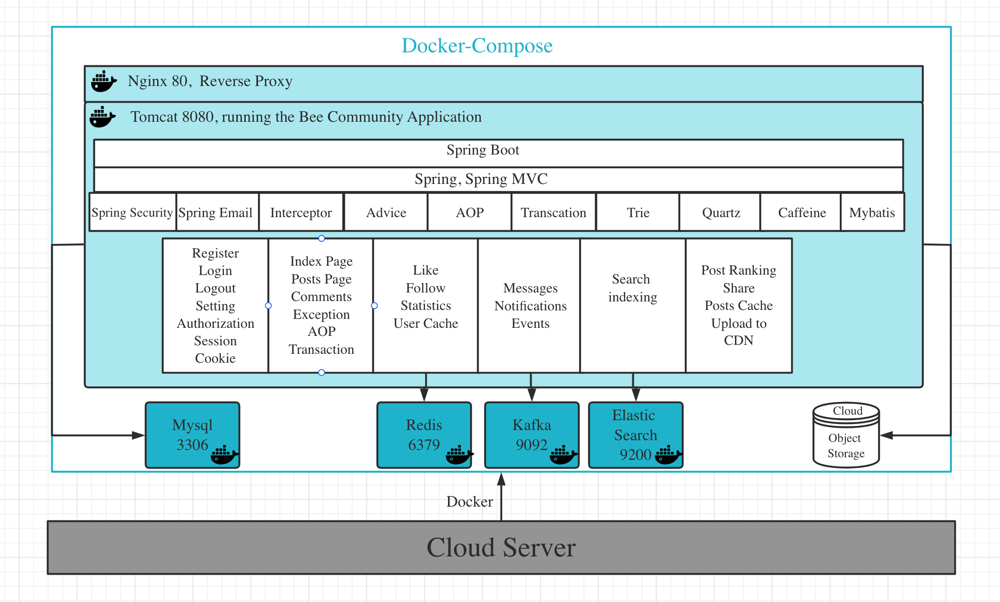

## Introduction
This is an online discuss community for teams, groups to share ideas and 
information efficiently. Let's name it "Bee Community". The application
demo can be found at  [82.156.26.62](http://82.156.26.62/).

## Installation
This forum application can be easily deployed using docker.

The application is equipped with single line of command to deploy using docker compose. Download this repo to the server
and run the following command. Upon completion, visit 82.156.26.62. That's it! 

```shell
# set your IP and deployment directory accordingly
# A server with >4GB memory is recommended.
sh install.sh  82.156.26.62 /project/forum
```

## Architecture


- The application is equipped with unified access-control and exception handling 
- Application logs can be recorded using AOP technique

## Functions Implemented
### for common users
- [x] register/activate using email
- [x] login/logout
- [x] kaptcha verification
- [x] make a post/comment
- [x] like a post/comment
- [x] set avatar/change password
- [x] send private messages
- [x] user profile page
- [x] system notifications
- [x] search for posts
- [x] follow a user
- [x] share an application page
- [x] automatic sensitive words filter
- [x] automatic rank featured posts

### extras for post administrator
- [x] pin a post
- [x] endorse a post

### extras for super administrator
- [x] UV statistics
- [x] DAU statistics
- [x] delete a post
- [x] application health monitor


### to do list
- [x] forget password
